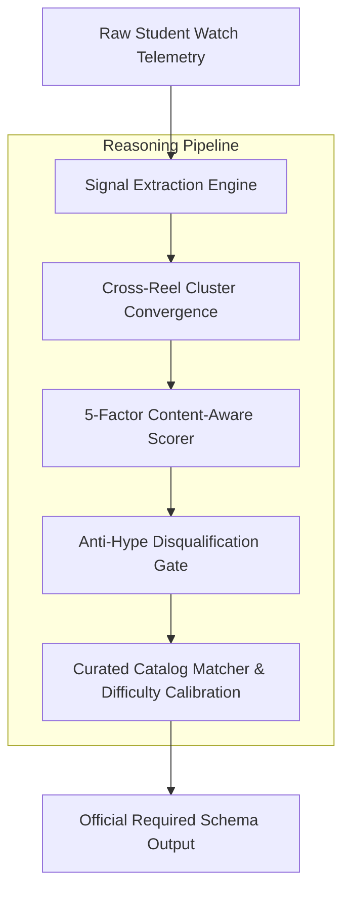

# 🎬 Reels Recommendation System
### AI-Powered Latent Interest Inference & Educational Tech Recommender

> **Autonomous AI Recommendation Agent** that analyzes short-form video watch telemetry, penetrates surface clickbait & keyword traps to infer genuine engineering interests, and recommends engaging, high-value technology Reels with transparent reasoning.

---

## 📌 Problem Statement & Core Challenge

Students spend significant time scrolling short-form video feeds. Much of it provides little educational or career velocity. Traditional recommendation algorithms rely on naive keyword matching:

* **The Built-In Keyword Trap**: A student watches a Java meme, a day-in-the-life SWE vlog, a coding interview skit, and a laptop comparison.
  * ❌ **Naive Matcher**: Recommends another generic Java syntax reel.
  * ✅ **Our AI Agent**: Infers the broader latent interest — **Software Engineering Career & Systems Architecture** — and recommends career-advancing depth (e.g., *"What Senior Engineers Do Differently"*).
* **Anti-Hype Disqualification Rule**: Actively filters out shallow clickbait (*"10 AI tools that will get you a job"*, *"Become a Cloud Engineer in 7 Days"*) in favor of foundational engineering rigor (Distributed Systems, Concurrency, Hardware Architectures, Application Security).

---

## 🏗️ System Architecture



---

## 🧮 5-Factor Content-Aware Scoring Engine

When Gemini or the deterministic engine evaluates candidate catalog reels against watched telemetry, it computes a holistic affinity score:

$$\text{Affinity}(c) = w_1 \cdot S_{\text{category}}(c) + w_2 \cdot S_{\text{tags}}(c) + w_3 \cdot S_{\text{semantic}}(c) + w_4 \cdot S_{\text{format}}(c) + w_5 \cdot S_{\text{cluster}}(c) - P_{\text{hype}}(c)$$

Where:
1. **$S_{\text{category}}$**: Category resonance weighted by watch percentage and rewatches.
2. **$S_{\text{tags}}$**: Jaccard and semantic overlap between watched hashtags and candidate syllabus tags.
3. **$S_{\text{semantic}}$**: Transcript and caption keyword correlation.
4. **$S_{\text{format}}$**: Content intent mapping (e.g. skits and vlogs amplify career/workplace trajectory).
5. **$S_{\text{cluster}}$**: Cross-reel pattern convergence across the entire 6–8 reel sequence.
6. **$P_{\text{hype}}$**: Penalty ($-\infty$) for deliberate hype distractors when educational depth is requested.

---

## 📋 Required Schema Output Conformity

The system strictly outputs all 8 mandatory problem statement fields:

```text
CURRENT REEL: #1 "Java vs C++ Memory Leak Meme" (Java, 95% watch, liked); #2 "Day in the Life of a Google SWE" (Career, 100% watch, liked); #3 "Coding Interview Joke: Inverting Binary Tree" (Career, 90% watch); #4 "M3 Max MacBook Pro for Devs" (Hardware, 85% watch)
INTEREST DETECTED: Software Engineering Career Growth & System Architecture
WHY: High retention and engagement across engineering lifestyle, interview culture, and development hardware indicate career ambition rather than Java syntax learning.
RECOMMENDED TECH REEL: What Senior Engineers Do Differently
CATEGORY: Career
WHY THIS RECOMMENDATION: Bridges student interest in software engineering lifestyle with actionable architectural practices and career progression.
DIFFICULTY: Intermediate
CONFIDENCE: High
```

---

## 🧪 Benchmark Calibration Sessions

| Session | Focus Area | Defense Challenge | Target Recommendation |
|---|---|---|---|
| **Session 1** | Software Engineering Trap | Must avoid shallow Java keyword trap | *What Senior Engineers Do Differently* (Career) |
| **Session 2** | Pure Java Language Mastery | Deep specialization across JVM/Spring | *Java Garbage Collection Deep Dive* (Java) |
| **Session 3** | AI & Neural Foundations | Must reject "10 AI Tools" clickbait | *How Transformers Work: Attention Explained* (AI) |
| **Session 4** | Hardware & Architecture | Hardware, memory, and cache depth | *CPU Cache Hierarchy: Fast Code* (Hardware) |
| **Session 5** | Mixed / Ambiguous Explorer | Ambiguous telemetry across topics | Calibrated to **Low Confidence** |
| **Session 6** | Gaming, Security & Cloud (7-Reel) | Full 7-reel sequence with skipped hype | *SQL Injection Explained* (Cybersecurity) |

---

## 📦 Curated Recommendation Catalog (18 Items)

The catalog includes 15 peer-reviewed educational tech reels and **3 deliberate anti-hype test distractors**:
* `cat_01`: System Design: How URL Shorteners Work (HLD)
* `cat_02`: Distributed Caching with Redis & Memcached (HLD)
* `cat_03`: Dynamic Programming: From Recursion to Memoization (DSA)
* `cat_04`: ⚠️ *[HYPE DISTRACTOR]* 10 AI Tools That Will Get You a Job Tomorrow (AI)
* `cat_05`: How Transformers Work: Attention Is All You Need (AI)
* `cat_06`: Building a Neural Network from Scratch in Python (AI)
* `cat_07`: Java Garbage Collection Deep Dive: G1 vs ZGC (Java)
* `cat_08`: Spring Boot Microservices: Circuit Breakers with Resilience4j (Java)
* `cat_09`: Kubernetes Networking: Pod-to-Pod Communication (Cloud)
* `cat_10`: Docker Multi-Stage Builds for Minimal Images (Cloud)
* `cat_11`: How Modern GPUs Work: SIMD Architecture Explained (Hardware)
* `cat_12`: CPU Cache Hierarchy: L1/L2/L3 Why It Matters (Hardware)
* `cat_13`: Cracking the FAANG System Design Interview (Career)
* `cat_14`: What Senior Engineers Do Differently (Career)
* `cat_15`: SQL Injection Explained with Real Examples (Cybersecurity)
* `cat_16`: ⚠️ *[HYPE DISTRACTOR]* Become a Cloud Engineer in 7 Days (Cloud)
* `cat_17`: ⚠️ *[HYPE DISTRACTOR]* Make $10k/Month with No-Code AI (Career)
* `cat_18`: Reverse Engineering a Malicious Binary (Cybersecurity)

---

## ⚡ Quickstart & Local Development

### Prerequisites
* **Node.js**: v18.0.0 or higher
* **npm**: v9.0.0 or higher

### Installation
```bash
# Clone the repository
git clone git@github.com:JAYA-KRUSHNA/promptwars.git
cd promptwars

# Install dependencies
npm install

# Configure environment variables
cp .env.example .env
# Edit .env and set your GEMINI_API_KEY
```

### Running Locally
```bash
# Start Vite development server
npm run dev

# Run full automated test suite (34 test cases)
npm test

# Run type check and lint
npm run lint

# Production build with chunk splitting
npm run build
```

---

## 🌐 API Reference

### `POST /api/analyze`
Analyzes a watch sequence and returns the inferred interest and curated recommendation.

**Request Body:**
```json
{
  "sessionId": "session_1",
  "selectedReelIds": ["reel_101", "reel_102", "reel_103", "reel_104"],
  "customReels": [],
  "apiKey": "optional_override_key",
  "model": "gemini-2.5-flash"
}
```

**Response:**
```json
{
  "success": true,
  "analysis": {
    "interest_detected": "Software Engineering Career Growth & System Architecture",
    "why": "...",
    "recommended_tech_reel": "What Senior Engineers Do Differently",
    "recommended_reel_id": "cat_14",
    "category": "Career",
    "difficulty": "Intermediate",
    "confidence": "High",
    "reel_signals": [...]
  },
  "source": "gemini",
  "latencyMs": 1180
}
```

### `GET /api/health`
Health and API key availability check.

### `GET /api/catalog`
Returns the 18-item curated recommendation catalog.

### `GET /api/sessions`
Returns the 6 benchmark calibration sessions.

---

## 🔒 Security & Privacy Architecture
* **Server-Side API Key Storage**: Private keys are stored in serverless runtime environment variables and never sent to browser clients.
* **Security Headers**: Standard HTTP headers (`X-Content-Type-Options`, `X-Frame-Options`, `Referrer-Policy`, `Permissions-Policy`).
* **Input Sanitization**: Request bodies are payload-size bounded (256 KB) and string-sanitized to prevent injection attacks.
* **WCAG 2.1 AAA Accessibility**: High color contrast ratios, full keyboard navigation (`Space`/`Enter`), ARIA live regions, and screen reader skip links.

---

## 📄 License
MIT License. Open source and free for educational and research use.
